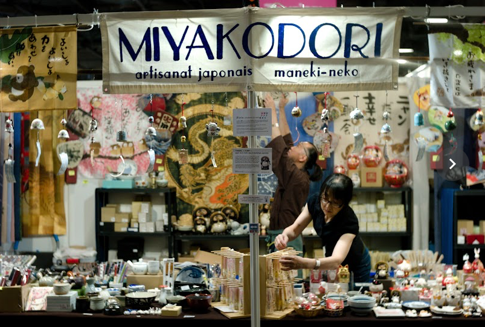

+++
title = 'Japan Expo 2023'
date = 2023-07-15T10:30:07+01:00
+++

Le capteur CCD du M8 qui date de 2006 me surprend par sa netetté. 

Cela s'explique par le fait que ce capteur ne possède pas de filtre anti-aliasing.

Nokton 35mm 1.4 à 1.4(!) et 1/125s à 640 ISO.

J'ai l'impression de faire des photos au kodachrome.

