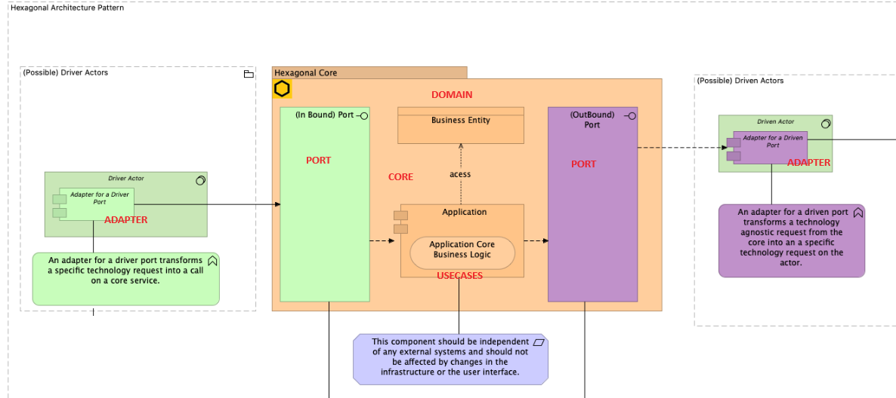

+++
title = 'Hexagonal Programming : Part 2'
date = 2024-05-15T01:15:30+02:00
tags = ["computer science"]
+++

## Programmation Hexagonale : (Part 2)

La partie 1 posait le vocabulaire : 

Ce que j'avais en tête :

Quelque chose de simple, un adaptateur à gauche sur le port d'entrée de l'hexagone, un adaptateur à droite sur le port de sortie  de l'hexagone et au milieu un traitement de base.

Et quelque chose qui tienne dans moins de 200 lignes de code go.

Cette partie 2 structure un projet golang avec les composants du schéma ci-dessus sous la forme :

projet :
   - cmd
   - internal
      - adapters
         - primary
         - secondary
      - core
        - domain
        - ports
        - usecases

le cas d'usage est très simple :

- préparation du code hexagonal avec injection des adaptateurs dans leurs ports respectifs
- envoie d'une commande technique du type par exemple GET/users sur le port primaire (simulée par le format string)
- accés au port secondaire qui est relié au référentiel des Users
- conversion de la réponse métier du port secondaire dans le core domaine dans un format technique
- retour de la réponse au format technique
- l'exemple est évidemment didactique, le référentiel des users est simulé ainsi que la commande de type GET/users

les schémas sont repris dans le README du code :

Le code sur https://github.com/jeandi7/hexagonal_part2