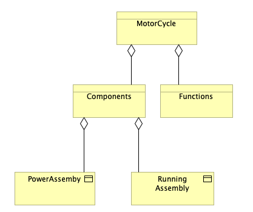
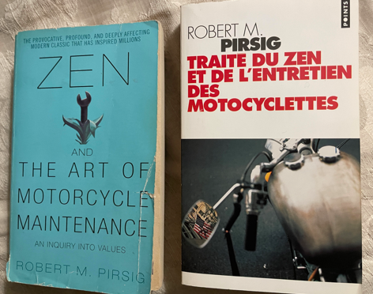

+++
title = 'Robert M.Pirsig : Zen and the art of motorcycle maintenance (1974)'
date = 2024-05-29T01:12:17+02:00
tags = ["reading"]
+++

## Zen and Quality

 - I discovered the book 25 years ago. 
 - I read it twice.
 - I will read it a third time.
 
 - What can I add about this strange book that hasn’t already been said?

_This schema is extract from chapter8 and made with @Archi_

> (Chapter 8) ...I look at the shapes of the steel now and I see _ideas_. 
> He thinks I'm working on _parts_.
> I'm working on _concepts_...

If you work in IT you must read this book

If you don't work in IT you must read this book