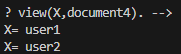
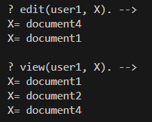

+++
title = 'Google Zanzibar Access Management language-like with Golang + Prolog'
date = 2024-06-04T01:03:43+02:00
tags = ["computer science"]
+++

Google Zanzibar is a globally distributed authorization system capable of processing million of client queries per second.

At first glance Google's Consistent Global Authorization System paper (2019) is not easy to read.

The code provided here is a didactic example to understand the spirit of the google zanzibar language.

For this example I used the Ichiban prolog library developed in Go.

There are today several access management solutions that are inspired by Zanzibar (Zanzibar is exclusively used by Google).

Most Zanzibar-like solutions are developed in Go (Zanzibar included) and sometimes in Rust.

For more details see https://github.com/jeandi7/prologzanzibar

_who can permission object ?_

_what can user do ?_ 

