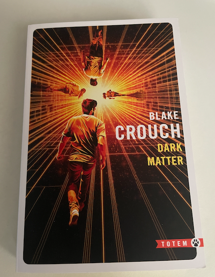

+++
title = 'Dark Matter (Blake Crouch)'
date = 2024-07-07T10:48:13+02:00
tags = ["reading"]
+++

## Dark Matter (Blake Crouch)

Ma femme et mes enfants m'ont offert ce roman SF de Blake Crouch.
Je ne connaissais pas cet auteur, je les en remercie.

J'ai eu quelques jours de disponibles fin juin et je l'ai lu d'une traite !
C'est une bonne variation sur les univers parallèles et l'interprétation de la mécanique quantique d'Everett.

PS : Au début du roman, l'auteur cite le principe du rasoir d'Occam.

