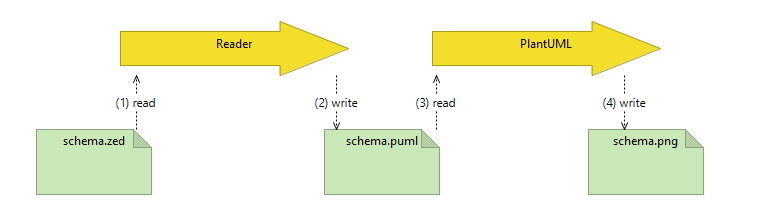
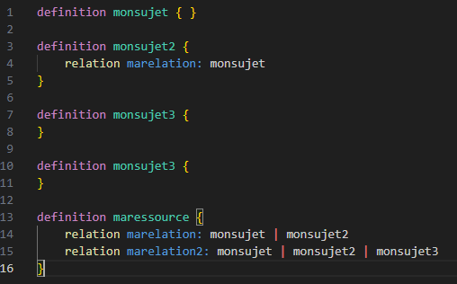
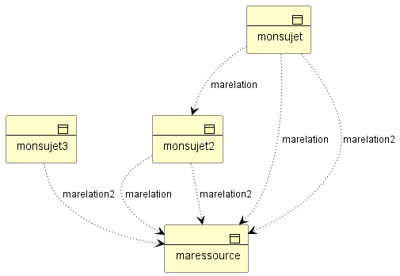

+++
title = 'Zanzibar SpiceDB-like Reader +  Archimate PlantUML Generation Code  in less than 450 lines of golang : part II'
date = 2024-07-25T01:42:04+02:00
tags = ["computer science"]
+++

part One is here : https://github.com/jeandi7/zreader1

We find ourselves 100 lines later (350 + 100) from part I

Unlike Part One, the Reader adds now a generation of a plantUML code file.

Honestly compared to part 1, this is the easiest part.

The most complex part is writing the BNF grammar.

The goal is to visualize a business object diagram  (with Archimate standard) with the well-know plantUML tool.

The reader part II process is :

The zed file as input is :

The png file as ouput is :

Code and details are here : https://github.com/jeandi7/zreader2
