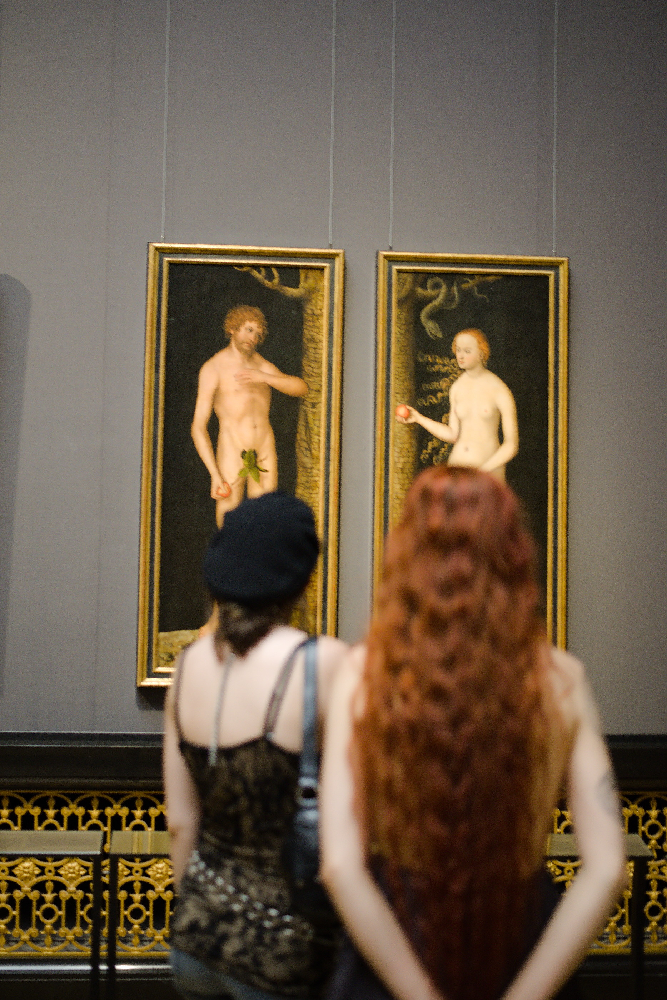

+++
title = 'Wien Kunsthistorisches Museum 2024'
date = 2024-08-07T16:03:00+02:00
tags = ["photography"]
+++

Wien Kunsthistorisches Museum 2024

Ich hatte nur eine Sekunde Zeit,um dieses Foto von Adam und Eva von Lucas Cranach (1515) aufzunehmen.

Die Haarfarbe des Mädchens stimmte mit der Haarfarbe von Eva überein.

nikon D610, 50mm f2, 1/60 , 800 ISO

