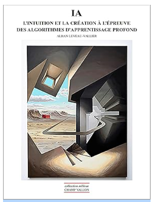

+++
title = 'IA Algorithme Intuition Creativité'
date = 2024-12-03T23:40:40+01:00
tags = ["reading"]
draft = true
+++

## IA 

Je viens de finir la lecture du livre "IA : L'intuition et la création à l'épreuve des algorithmes" par ALBAN LEVEAU-VALLIER chez "l'éditeur collection milieux, CHAMP VALLON."

Le livre est très dense et fourmille de références philosophiques.

Je vais en citer une seule, qui se situe vers le début du livre chapitre 2.

L'auteur compare alors les 2 écoles de l'IA.

| Ecole  | Symbolique   |  Connexionniste  |
|---    |---    |---    |
|Apprentissage | Ajout par le programmeur|Par l'exemple|
|Représentation   | Définitions explicites|Valeurs numériques|
|Mémoire|Stockée à part|Distribuée dans le réseau|
|Opérations|Séquentielles|Parallèles|

