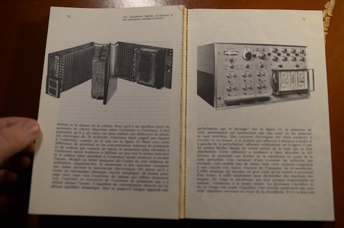

+++
title = 'AI Algorithm Intuition Creativity'
date = 2024-12-03T23:40:40+01:00
tags = ["reading"]
+++

## AI : Symbolic versus Connectionist

My father gave me the following book “La Bionique from Lucien Gérardin, edited in 1968” when I was 12-13 years old:

*At that time, I was watching "The Six Million Dollar Man" with Lee Majors on TV, which is why the title (Bionics) of the book intrigued me greatly...*

It was the first time I came across the term 'perceptron', one of the first artificial neural networks described in this book,  and there was a page that pitted a digital  computer against an analog  one.

*A digital computer component on the left page, an analog computer element on the right page.*

You can recognize the patch panel of the analog computer.

Wow. I was fascinated. I long kept this opposition of concepts and technologies in my mind.

I am now going to jump a few decades.

Lately, I've finished reading the book "IA : L'intuition et la création à l'épreuve des algorithmes" ("AI: Intuition and creation put to the test of algorithms") by ALBAN LEVEAU-VALLIER at "the publisher collection milieus, CHAMP VALLON." (edited in October 2023)

The book is very dense and full of philosophical references. 
I was able to delve deeper into and review philosophical points.

I will quote just one philosophical point, which is located towards the beginning of the book chapter 2.

The author observes that it seems difficult to provide a universally accepted definition for the term AI.

What can be said is that there have been two schools of thought in AI since 1956.
The conference during the summer of 1955 at Dartmouth College is considered the founding event of the discipline.

The author then compares the two schools of AI.

| School  | Symbolic   |  Connectionist  |
|---    |---    |---    |
|Learning | Added by the programmer|By example|
|Representation   | Explicit definitions |Numerical values|
|Memory|Stored separately|Distributed in the network|
|Operations|Sequential|Parallel|

Far from being opposed (which seems to be the case after a first reading of this table), the two schools accept as true the following hypothesis:

"The study is to proceed on the basis of the conjecture that every aspect of learning or any other feature of intelligence can in principle be so precisely described that a machine can be made to simulate it."

The two schools pursue the same objective. The term simulation is very important.

(You will note that the verb used is 'simulate' and not 'create')

This is followed by a very interesting discussion on the history of the two schools, what sets them apart, and what brings them together.

Reading this last book means that I no longer oppose so directly the two schools now.

The symbolic school relies on rules and discret symbols (associated with the digital), while the connectionist school draws inspiration from cybernetics, neural networks and operates continuously (associated with the analog).

Analog and Digital are complementary technologies.

See https://jeandi7.github.io/jeandi7blog/posts/25-post/

