+++
title = 'Quadriphonic SQ decoder in less than 50 lines of golang or Analog Computing in Digital Computing Era : Part 2'
date = 2025-01-26T21:59:31+01:00
tags = ["computer science"]
+++

This part follows part 1 from Quadriphonic SQDecoder from my previous article.

# Analog Computing in Digital Computing Era

A few words about Analog Computing.

The analog computer has existed since the dawn of time (think of the Antikythera mechanism from ancient Greece).

I learned a lot of things in this book about analog computing.

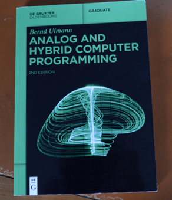

The book from Dr. Bernd Ulmann is a gem.

It is both theoretical and practical-oriented for engineers. 

Analog computer excels in tasks requiring real-time control or simulation of physical systems. (And we can also imagine future use cases in cybersecurity or machine learning)

And that's not all, analog computing is vastly more energy-efficient than digital computing. 

Programming an analog computer involves setting up physical components to solve specific equations (often differential equations) or 
simulate systems. 

An analog computer provides you with a set of components that you can connect to each other through a configuration panel.

With an analog computer, you adjust,configure and connect various components (operationel amplifiers) like summers,integrators,multipliers,inverters  or *free* components (resistors,capacitors and inductors) to model mathematical relationships. Potentiometers are used to introduce coefficients.

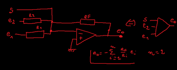

*Summer with 2 inputs based on an operational amplifier with negative feedback. S is the summing junction.*


# Analog SQ decoding

SQ matrix equations seen in part 1 : 

```
// SQ decoding
lf = LT 
rf = RT
lb := j*alpha*LT - alpha*RT = -alpha * (RT - j*LT)
rb := alpha*LT - j*alpha*RT = alpha * (LT - j*RT)
```
The SQ decoding calculation above can be illustrated by the corresponding analog diagram:

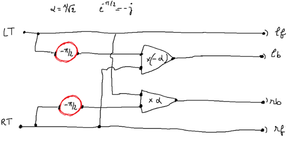

*First iteration schema.The input stereo signal (LT,RT) is on the left*

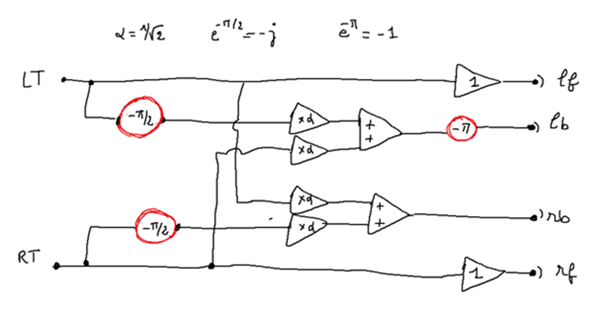

*2nd iteration schema : I make the summers appear*

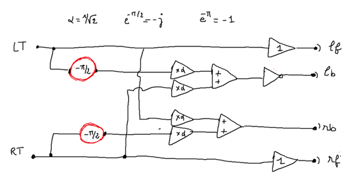

*Third iteration schema : i make the inverter appear*

At this step, i still need to make the -π/2 phase shifters appear.

The book about Analog Computing contains very several interesting pages to truly analyze delay circuits. (delay-circuits can be grouped into three classes)

An example is proposed based on an integrator circuit (class 3 : continuous time and continuous values)

I refer you to the book for reading. (5.17.4 Analog delay networks : 1st-order and 2-nd order Padé approximation)

As far as we're concerned, we'll make do with just an all-pass filter using R and C components, which we know is sufficient to maintain audio quality without sound distortion issues.

# Low Pass Filter example 

The following simulations are performed under LTspice. The code for the schemas is in the git project given below.

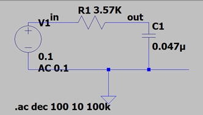


*Bode Plot Diagram and cut-off frequency with R = 3.57k ohms  and C = 0.047µ farad*


*Ideal Bode Plot diagram*


*Here we can observe a phase shift of almost π/2 between the two signals*

# All Pass Filter example 

By “cascading” together a single Low Pass Filter circuit with a High Pass Filter circuit, we can produce another type of passive circuit

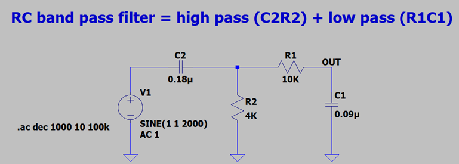


# Wein Bridge All Pass Network and Motorola MC1312P

We can also change the previous circuit to get what's called a wein-bridge

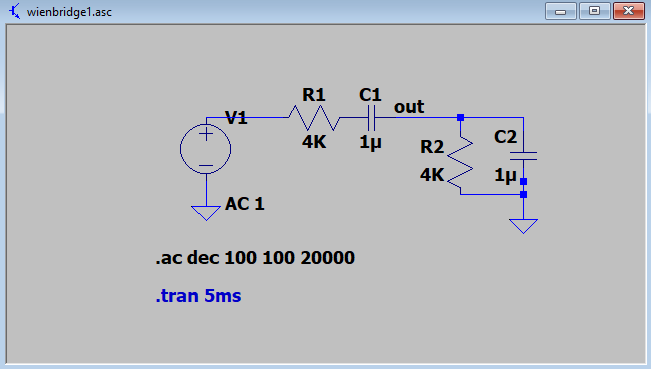


Unfortunately I don't have (today) an analog computer with input/output that would allow me to test in real time an SQ decoder.

But fortunately, you can always find the Motorola MC1312P chipset on the market, which implements the following circuit with 2 phases shifts at 0°, 2 phases shifts at -π/2 as well as the   necessary op-amps

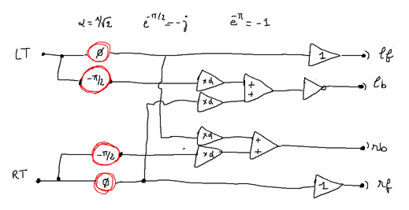

*2 phase-shift at 0° and 2 phase-shift at -π/2 symbolized with the red circles...*

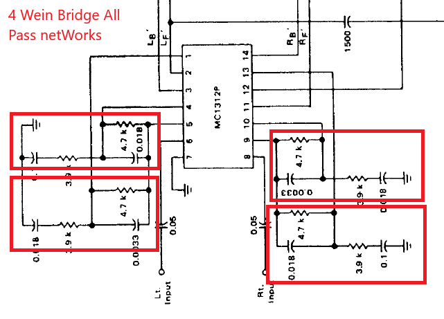

*...that can be found here (extract from the manufacturer's documentation)*

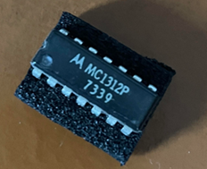

*The chipset Motorola MC1312P was launched on the market in the year 1973.*

I put the LTSPICE files (*.asc) as well as the (public) motorola documentation on 

https://github.com/jeandi7/sqdecoder2

to be continued...

# sources

"Analog and Hybrid Computer Programmming" : from Bernd Ulmann (De Gruyter OldenBourg 2nd Edition)

"Science et Vie n°655 : Avril 1972 " : "Quadraphonie ..." from Roger Bellone

*you will note that the french term used in 1972 is quadraphonie and not quadriphonie*

"Science et Vie N°4 hors-série 1976 " : "La tétraphonie n'est pas un gadget" page 114 from Gérard Rainguez

*you will note that the french term used is tetraphonie and not quadriphonie*

"Encyclopédie illustrée de l'image et du son" from Zdeneck Krecan: Gründ : 1980 : ISBN 2-7000-1305-0

*In this book you will find a description of the _dual-head_ phonograph exhibited in the National Technical Museum of Prague.*

"Initiation Hi-Fi stereophonie/quadriphonie : S.E.C.F - Editions radio" from Pierre Chauvigny  : 1980 : ISBN-2-7091-0820-8

About Quadraphonic Systems (and Poincaré Sphere): https://midimagic.sgc-hosting.com/quadrafon.htm

About Quadraphonic Matrix Math : https://midimagic.sgc-hosting.com/quadmath.htm

About SQ :  https://www.4channelsound.com/encode.htm

