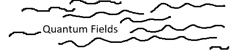
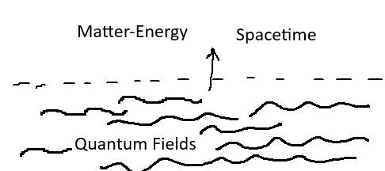
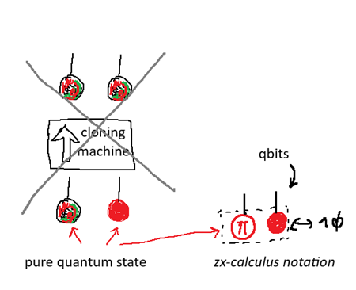
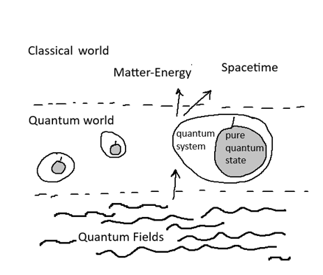
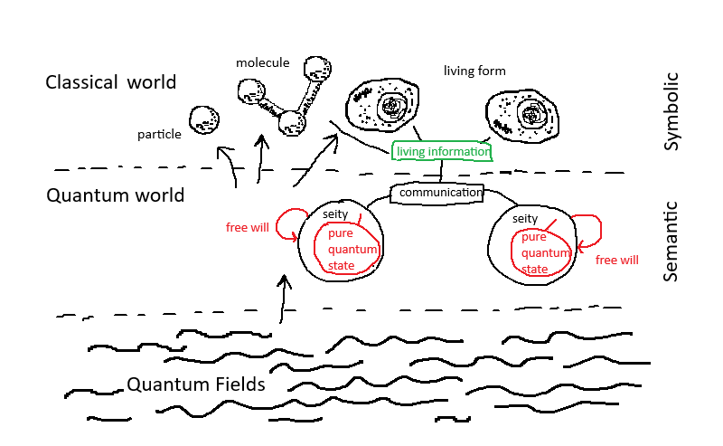
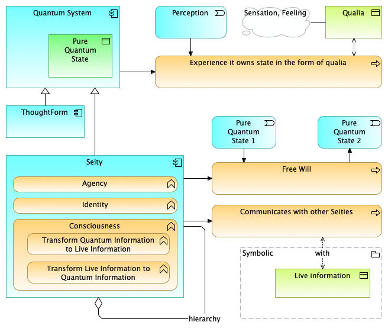
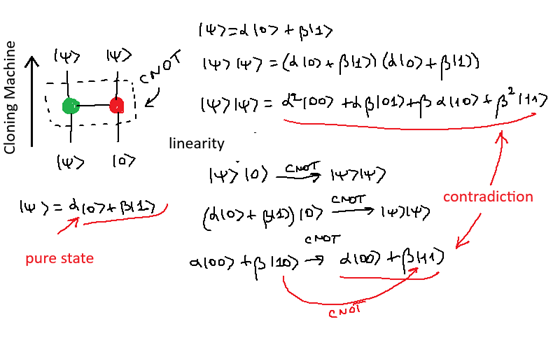
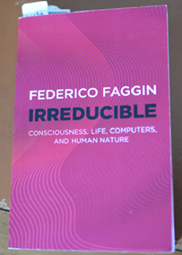

+++
title = 'Archimate, Conscious agent, Free-Will, Intel 4004, No-cloning theorem, Panpsychism, Qualia, Quantum worlds, Wave function collapse, ZX-calculus, Zilog Z80/Z8'
date = 2025-03-30T22:12:15+02:00
tags = ["computer science","reading"]
+++

I just finished reading the book "Irreducible" " by Federico Faggin (2024, Essentia).

I discover Federico Faggin who is physicist, engineer, inventor and entrepreneur. 

He has designed the first commercial microprocessor the Intel 4004 in 1970-1971.
He was co-founder and CEO of Zilog and led the development of the Z80 and Z8 processors.

Today, Federico turns his attention to consciouness and the nature of reality.

# The new paradigm

I'll try to make you want to read the book with these few lines. I made some illustrations from reading the book.
(but this obviously does not replace reading the book)

Physics postulates today the existence of quantum fields...

...that transform themselves into matter-energy and spacetime

Knowing that the state of a quantum system cannot be directly known (no-cloning theorem see below), the quantum state is completely private to the quantum system, just like the sensations and feelings that emerge from a conscious entity after the perception of information. (Philosophers use the term "qualia"). My father told me that the experience of others is not shareable.

*No-cloning theorem.I use the ZX-calculus notation to represent a quantum state*

Whereas classical information is public and can be copied, quantum information is private and knowable only by the quantum system.

> A quantum system,as long as it exists in a pure state has a qualia experience, but it is not self-conscious. 

The fact that a pure quantum state(*) cannot be copied makes it homomorphic to the experience of a qualia that I can feel (The qualia belong to what Federico Faggin calls the "Semantic World") but can only partially share with words (The words belongs to what Federico Faggin calls the "Symbolic World")

The new paradigm postulates the existence of a quantum entity named Seity :

> Seity is a quantum entity with three irreductible properties :identity, agency, and consciousness that can direct her own experience with free will.

This is the whole point of the book.
By embedding consciousness into quantum fields from the outset, Federico Faggin  explains 
- the wave function collapse through free will, 
- clarifies why a classical AI, which belongs to the symbolic world, will never achieve consciousness and therefore true intelligence. (no singularity on the horizon)
- the brain (made up of matter) does not produce consciousness, but it is consciousness that produces matter
- and provides us, as a bonus, a non-perishable individual consciousness.

(*) A pure quantum state is a single, well-defined quantum state described by a single wavefunction, representing maximum knowledge about a system. In contrast, an impure quantum state is a statistical mixture of multiple pure states, reflecting incomplete information about the system.

(**) I remember a book I read when I was a student : "L’Âme et le Corps"  (Soul and Body, 1912) by Henri Bergson , the philosopher had a very very strong intuition. 
>The brain is an organ of pantomime, and of pantomime alone. Its role is to mimic the life of the mind, as well as to mimic the external situations to which the mind must adapt.
>Cerebral activity is to mental activity what the movements of a conductor are to a symphony. The symphony extends far beyond the movements that mark its rhythm; likewise,
>the life of the mind overflows the life of the brain."

# Quantum Information-based Panpsychism (QIP)

*made with Archi with ArchiMate® Specification*

The architecture diagram of QIP framework  that I made during my reading of the book.

I have represented in the diagram the Free Will process that transitions from the Pure Quantum State 1 to the Pure Quantum State 2. 

A point that I discovered important during my readings about the sequence of these quantum states, Quantum State 1, Quantum State 2, ...Quantum State N :

- The history of consciousness state (Quantum State 1, Quantum State 2, ..., Quantum State N) over time is modeled in a document listed in the bibliography (Federico Faggin and Giacomo Mauro D'Ariano : Hard Problem and Free Will : 2020, chapter 4 and chapter 5)

- The conclusion is that there is actually no room for long-term memory in consciousness, the time in which we collect each conscious experience is short, namely of the order of a second. (The demo is based on that all (quantic) operators from and to the Hilbert space are contractions, namely have norm bounded by 1)

# The no-cloning theorem

The no-cloning theorem is a cornerstone of quantum information science.

I memorized for fun the proof of the no-cloning theorem. (I learned some time ago ZX-calculus)

The proof by contradiction takes up only a few lines. It can be found everywhere on the internet, and even if one doesn’t master quantum computing, it’s easy to see that the expressions on either side are not identical (quadratic on one side, linear on the other)

remark : "Quantum computers..are deterministic systems and therefore cannot make freewill decision"  ("Irreductible", page 108)

# Bibliography

- Irreducible: Federico Faggin : Consciousness,life,computers, and human nature : ISB 978-1-80341-509-3 (eng. version),
- Irriducibile: Federico Faggin :  La coscienza, la vita, i computer e la nostra natura : ISBN 10 8804739037,ISBN 13 9788804739036 (it. version)
- Hard Problem and Free Will: Giacomo Mauro D'Ariano and Federico Faggin : an information-theoretical approach (2020), Operational
Probabilistic Theory (OPT): https://arxiv.org/abs/2012.06580
- W. K. Wootters et W. H. Zurek, « A single quantum cannot be cloned », Nature, vol. 299, no 588, octobre 1982
- ZX-Calculus and Quantum Compilation  : https://github.com/zxcalc/book?tab=readme-ov-file
- L'âme et le corps : Henri Bergon (1912)