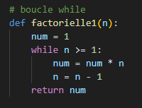
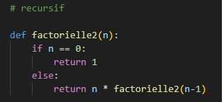
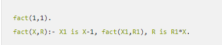
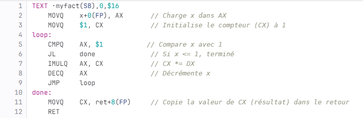

+++
title = 'Style'
date = 2023-11-01T02:03:46+01:00
+++

# Programming style

"XIV. — Reason and logic are faculties which are sufficient in themselves, and in the operations which relate to them" (Thoughts for myself Marcus Aurelius 121 - 180)

## Write a factorial (with python) in :

### structured programming style:

### recursive programming style:

### functional programming style:

### by constraints (or logic programming):

*explanation:*

>fact(5,120):- fact(4,24) and 120 = 24*5
>
>fact(4,24):- fact(3,6) and 24 = 6*4
>
>fact(3,6):- fact (2,2) and 6 = 2*3
>
>fact(2,2):- fact(1,1) and 2 = 1*2
>
>fact(1,1).

we come across the predicate without argument "." , called in English “cut” and in French “coupe-choix” we end here.

### in x86 Assembler (spaghetti style):

the code on asm2 : https://github.com/jeandi7/asmandgo

###  sources:

How to calculate factorial using prolog - prolog, factorial (living-sun.com)

Marseille at the beginning of the 70s: 

>"Alain Colmerauer had developed and implemented Prolog for the
>purpose of parsing natural language—Prolog’s clauses were intended initially as context-free
>grammar rules" (Roussel, 1975; Colmerauer et al., 1973). (extract from "AI a modern approach Russell/Norvig": 
>The book does not say explicitly that Colmerauer is the creator of the Prolog language)

>My Prolog course book: Colmerauer, A., Kanoui, H., Pasero, R., and Roussel, P. (1973). A system of
>man–machine communication in French. Report, Intelligence Group
>Artificial, University of Aix-Marseille II.

