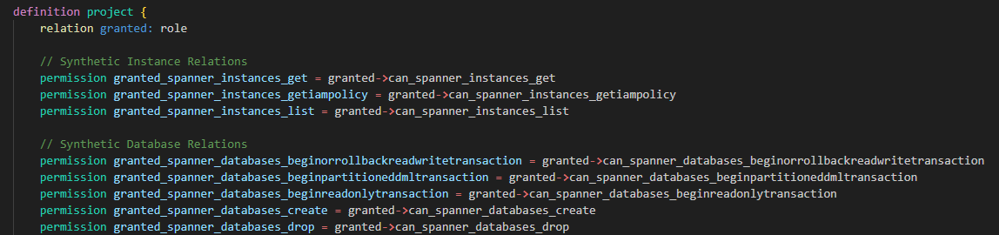
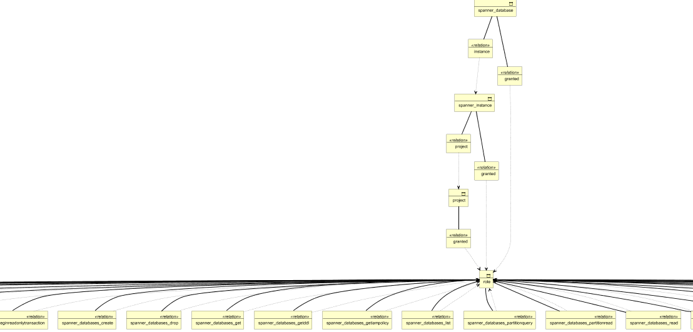
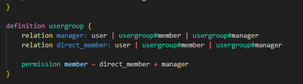
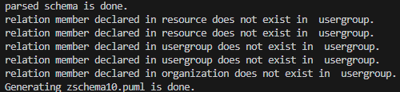

+++
title = 'Zanzibar SpiceDB-like Reader +  Archimate PlantUML Generation Code  in less than 1300 lines of golang : part V'
date = 2025-05-25T01:35:20+02:00
tags = ["computer science"]
+++

This part follows parts I to IV from Zanzibar SpiceDB-like Reader.

This time, I wanted to integrate the permission feature. 

This section only deals with modifying the grammar and coding it in Golang to be able to read a schema with permissions.

The drawing generation part (= semantic part) is not yet covered.

Code and details are here : https://github.com/jeandi7/zreader5

# Permission Feature

This feature is described in the zanzibar documentation.

The spicedb/authzed documentation explains :

> A permission defines a computed set of subjects that have a permission of some kind on the parent object.
> For example, is a user within the set of users that can edit a document.
> Permissions are always defined with a name and an expression defining how that permission's allowed set of subjects is computed:

## Examples : 
> permission view = reader + writer
>
>  permission view = ((reader)->writer)
>
> permission member = direct_member + administrator + group->member


# BNF grammar with permission feature

The  version that I wrote for permission declaration

The expr and expr1 parts allow for the elimination of left recursion in our LL(1) grammar.

As usual, I believe this is the most difficult phase (for me). Once the grammar is in place, the syntaxic coding part comes naturally.

I added additionally the elimination of comment lines (starting with //) in the lexical part.

I did not want to handle this at the syntactical level in the grammar. The only downside is that I lose the comments if I want to retrieve them for the drawing.

But for the moment I don't want to bother with that when writing the grammar.


```
// Zanzibar restricted EBNF grammar
// SpiceDB like
// relations and permissions are declared
// 

<Zschema> ::= <Zdef>*
<Zdef> ::= "definition" <Zname> "{" <Zbody> "}"
<Zname> ::= <identifier>
<Zbody> ::= (<Zrelation> | <Zpermission>)*     // * means zero or more <Zrelation> or <Zpermission>
<Zrelation> ::= "relation" <Rname> ":" <Sname> ("|" <Sname>)*
<Zpermission> ::= "permission" <Rname> "=" <RPexpr>
<RPexpr> ::= <RPterm> <RPexpr1>
<RPexpr1> ::= <Zop> <RPterm> <RPexpr1> | ''   // '' means RPexpr1 can be empty
<RPterm> ::= <Rname> | "(" <RPexpr> ")" | <Rname> "." "any" "(" <Rname> ")" | <Rname> "." "all" "(" <Rname> ")"
<Rname> ::= <identifier>
<Sname> ::= <Zname> | <Zname> "#" <Rname> | <Zname> ":" "*"
<Zop> ::= "+" | "&" | "-" | "->"     // I handle operator levels as the same priority.
<identifier> ::= [a-zA-Z_][a-zA-Z0-9_]*

```

*As usual, I had to ensure that there was no left recursion in RPexpr.*

# Example

I take 2 original examples of spiceDB/authzed documentation (which seem most complicated to me):

- zschema10.zed is Google Docs-style Sharing example
- zschema11.zed is Google IAM in SpiceDB example



*Extract example of zschema11.zed*

<span style="color:yellow">tape :</span> go run zreader.go -fschema "./zschema11.zed" -out "zschema11"

<span style="color:yellow">response: </span>

For the following diagram i changed the values in the generated file with scale = 0.15 and dpi = 300
(These two parameters scale and dpi allow you to zoom in or out while maintaining a sufficient resolution)

Using the generated zedschema11.puml file with PlantUML helps us to show the Archimate following diagram :



The permissions do not appear on the drawing since the semantic part of the permissions has not yet been processed.

As previously in part II,III and IV, even if the parser detects errors, it tries to draw what it can

For the zschema10.zed (Google Docs-style Sharing ) : 

 

 *Extract example of zschema10.zed*

<span style="color:yellow">tape :</span> go run zreader.go -fschema "./zschema10.zed" -out "zschema10"

<span style="color:yellow">response: </span>



The analyzer gives us this message because the permissions have not yet been interpreted but are seen as relationships.

But that's what I wanted for today and that's enough to make me happy, I can analyze spicedb files with relationships and permissions.

To be continued...

# Help mode

<span style="color:yellow">tape :</span> go run zreader.go -help

#

About Zanzibar : https://storage.googleapis.com/pub-tools-public-publication-data/pdf/0749e1e54ded70f54e1f646cd440a5a523c69164.pdf

About SpiceDB : https://authzed.com/blog/spicedb-is-open-source-zanzibar#everybody-is-doing-zanzibar-how-is-spicedb-different

About PlantUML : https://plantuml.com/fr/download
