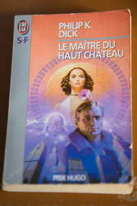

+++
title = 'Quantum worlds and the Man in the High Castle'
date = 2025-07-05T21:51:34+02:00
tags = ["reading"]
+++

*Yi King : Oracle 61 / Chung Fu / Inner Truth* 

*Hexagram used at the end of the book*

I reread (in french) The Man in the High Castle by Philip K. Dick a second time.

Because I just saw the excellent eponymous series on Amazon. (Saison 1 to 4, produced by Ridley Scott !)

And I, who am reading things about quantum right now, a sentence struck me when I came across it.

The sentence is located in chapter 4 of the book. I put it in italics. 

« We really do
see astigmatically, in fundamental sense: *our space and our time creations of our own psyche*, and
when these momentarily falter — like acute disturbance of middle ear. »

I don't want to spoil the novel or the series.

The hard problem of consciousness, space and time.

*The Man in the High Castle*

Go see Why : https://jeandi7.github.io/jeandi7blog/posts/29-post/