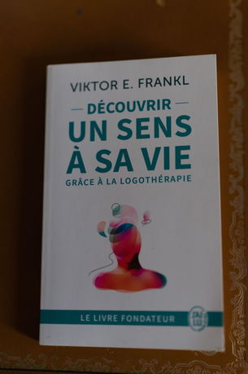

+++
title = 'Victor E.Franckl : Man s search for meaning'
date = 2025-07-30T21:02:35+02:00
tags = ["reading"]
+++

*The book in french version* 

I read (in french) Man's search for meaning from Victor E.Franckl.

The man is a survivor of the death camps and spent 3 years of his life in Auschwitz.

Upon his liberation from the camp, he developed what is known as the foundations of the third Viennese school: logotherapy.

(For information, the first is the Freudian school based on the "pursuit of pleasure," the second is the Adlerian school based on the "will to power.")

It was this personal project, conceived during his imprisonment, that allowed him to survive.

Logotherapy is based on the "search for meaning in life."

According to logotherapy, the meaning of life can be found:

1) through a work or a good deed

2) by experiencing something or someone (the meaning of love)

3) through one's attitude toward genuine suffering (the meaning of suffering)

Additionally, there is the concept of super-meaning: reasonably accepting one's inability to grasp an unconditional meaning in suffering.

I noted the method called paradoxical intention (PI):

- The fear of insomnia creates a hyperintention to sleep, which ultimately keeps the person awake.

- He advises doing the exact opposite: staying awake as long as possible, which then induces sleep.

Logotherapy defines what it calls the "tragic triad" and aims to address:

1) suffering

2) the feeling of guilt

3) death

Book to read.
