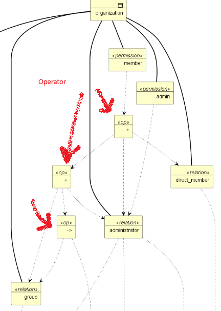
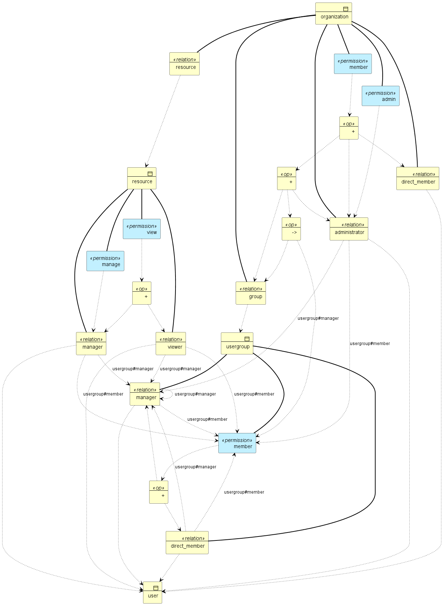
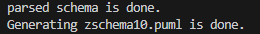

+++
title = 'Zanzibar SpiceDB-like Reader +  Archimate PlantUML Generation Code  in less than 1400 lines of golang : part VI'
date = 2025-12-05T00:18:52+01:00
+++

This part follows parts I to V from Zanzibar SpiceDB-like Reader.

Part V integrate the permission feature and this part VI integrate the drawing generation (= semantic part) 

I only added about a hundred lines for the semantic part.

Code and details are here : https://github.com/jeandi7/zreader6

# Recall about the Permission Feature

This feature is described in the zanzibar documentation.

The spicedb/authzed documentation explains :

> A permission defines a computed set of subjects that have a permission of some kind on the parent object.
> For example, is a user within the set of users that can edit a document.
> Permissions are always defined with a name and an expression defining how that permission's allowed set of subjects is computed:

## Recall about the examples : 
> permission view = reader + writer
>
>  permission view = ((reader)->writer)
>
> permission member = direct_member + administrator + group->member

# Recall about the BNF grammar with permission feature is the same as in part V

```
// Zanzibar restricted EBNF grammar
// SpiceDB like
// relations and permissions are declared
// 

<Zschema> ::= <Zdef>*
<Zdef> ::= "definition" <Zname> "{" <Zbody> "}"
<Zname> ::= <identifier>
<Zbody> ::= (<Zrelation> | <Zpermission>)*     // * means zero or more <Zrelation> or <Zpermission>
<Zrelation> ::= "relation" <Rname> ":" <Sname> ("|" <Sname>)*
<Zpermission> ::= "permission" <Rname> "=" <RPexpr>
<RPexpr> ::= <RPterm> <RPexpr1>
<RPexpr1> ::= <Zop> <RPterm> <RPexpr1> | ''   // '' means RPexpr1 can be empty
<RPterm> ::= <Rname> | "(" <RPexpr> ")" | <Rname> "." "any" "(" <Rname> ")" | <Rname> "." "all" "(" <Rname> ")"
<Rname> ::= <identifier>
<Sname> ::= <Zname> | <Zname> "#" <Rname> | <Zname> ":" "*"
<Zop> ::= "+" | "&" | "-" | "->"     // I handle operator levels as the same priority.
<identifier> ::= [a-zA-Z_][a-zA-Z0-9_]*

```

*As usual, I had to ensure that there was no left recursion in RPexpr.*

# Example

With the  zschema10.zed is Google Docs-style Sharing example

<span style="color:yellow">tape :</span> go run zreader.go -fschema "./zschema10.zed" -out "zschema10"

<span style="color:yellow">response: </span>

The permissions appear on the drawing since the semantic part of the permissions has yet been processed.

As previously in part II,III,IV and V, even if the parser detects errors, it tries to draw what it can

For the zschema10.zed (Google Docs-style Sharing ) : 



 *Extract example of zschema10.zed*

 

*Full schema*

<span style="color:yellow">tape :</span> go run zreader.go -fschema "./zschema10.zed" -out "zschema10"

<span style="color:yellow">response: </span>



The complex diagrams are no longer very readable and the color of the links is not possible with the PlantUML/Archimate extension.

This closes a stage, and at this point I feel the need for refactoring.

I read this year the book "Inventer le cinéma: Epistémologie, histoire et machines de vision" (Inventing Cinema: Epistemology, History, and Vision Machines : 2025) from Benoit Turquety and I learned that during the Renaissance, architectural decisions were delayed as much as possible until construction.

You can read on page 66 :

*"Architects and engineers did not have absolutely precise means of representing their projects before the beginning of the 16th century...In general, the architectural features of a construction in a project were not fixed in advance in all their aspects and details. The client and the architect merely had to agree only on the general features when the contract was drawn up...Two main reasons
...The first was the custom of postponing decisions on certain questions until a time when they could be made in view of the building under construction...The second, and probably the most important, was the fact that many features did not need to be explicitly discussed because they were obvious within a given building tradition.... "*


*Benoit Turquety's book "Inventing Cinema" offers a remarkable study of the architectural design of complex machines and the epistemology of technical thought*

This is exactly how I approach decision-making in architecture: I try to preserve the greatest possible number of degrees of freedom for as long as possible. In other words, I postpone irreversible choices until the latest responsible moment.The parallel with the historical practices described in the previous excerpt is striking: the first ‘feature’ really feels like agility (or deliberate deferral of decisions), while the second is clearly the reliance on shared, proven architectural patterns.

Naturally, this approach isn’t always feasible. 
That said, I was very pleased to learn recently that OpenAI has adopted Authzed/SpiceDB ...


To be continued...

# Help mode

<span style="color:yellow">tape :</span> go run zreader.go -help

#

About Zanzibar : https://storage.googleapis.com/pub-tools-public-publication-data/pdf/0749e1e54ded70f54e1f646cd440a5a523c69164.pdf

About SpiceDB : https://authzed.com/blog/spicedb-is-open-source-zanzibar#everybody-is-doing-zanzibar-how-is-spicedb-different

About PlantUML : https://plantuml.com/fr/download

About SpiceDB/Authzed and OpenAI  : https://authzed.com/customers/openai


