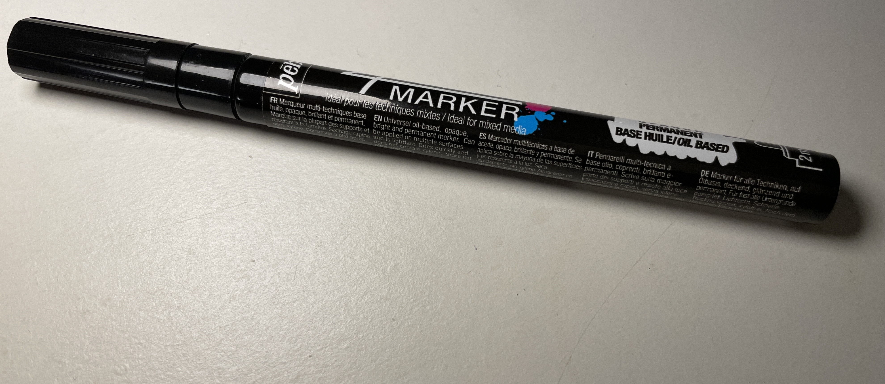
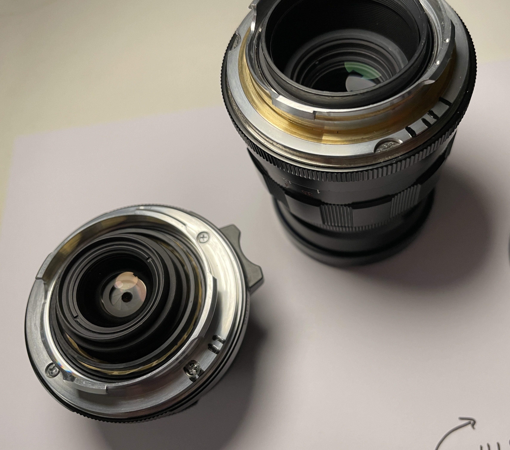
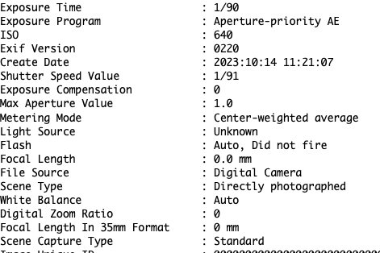
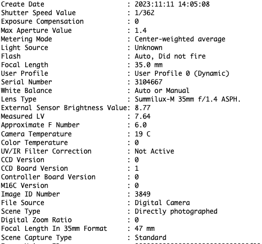

+++
title = 'Codage ....d optiques'
date = 2023-11-14T00:45:37+01:00
tags = ["photography"]
+++

- J'ai eu la chance de pouvoir trouver d'occasion un leica M8, sans garantie et dont personne ne voulait, 
à un prix inférieur à un iphone 11 d'occasion à ce jour.
j'ai codé ce week-end 3 optiques voigtlander , un 20mm f4, un nokton 35mm 1.4 et un 75mm 2.5 en monture vissante avec un adapteur M

- Le codage permet au boitier de reconnaitre l'optique, de corriger le fichier dng à la volée et de remplir l'EXIF avec
la focale, et une estimation de l'ouverture.
En effet, comme il n'existe aucun couplage de diaphgrame  entre les optiques M et le boitier M, un petit logiciel embarqué dans le boitier estime la valeur de l'ouverture en fonction de la lumière ambiante mesurée et la vitesse choisie. 
Je n'y croyais pas trop.

- L'outil :  un stylo de peinture noire

- Les optiques codées :

Le résultat.
Ca marche du premier coup.

- Avant sans codage: l'exif 

- Après avec codage : l'exif

On y trouve  un "Approximate f number" de 6  (soit f5.6 ou f8 en réalité ), la focale de 35mm du voigtlander Nokton et son ouverture max de 1.4  (outil phil's exif tool). Oui j'ai codé le Nokton comme un Leica 35mm 1.4 ASPH qui fait 10 fois son prix...

Une dernière image à pleine ouverture 35mm à 1.4 et 1/60s 

là j'ai comme ouverture indiquée dans le fichier.png une ouverture de f1.0!.
Bon, ce n'est pas totalement exact quand même.
Il faut prendre ce calcul comme une simple indication.

La source où j'ai trouvé le codage binaire des optiques :  https://lavidaleica.com/content/leica-lens-codes
