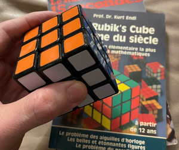

+++
title = 'Monoïdes et autres structures algébriques'
date = 2019-10-18T02:05:38+01:00
+++

j'ai un groupe dans ma main et des souvenirs de première et de terminale C.

A l'époque je ne me doutais pas du rapport avec la programmation ....
Ce sont les monoïdes aujourd'hui qui m'intéressent.

Le code (simpliste) d'un monoide en golang ici : 
Voir https://github.com/jeandi7/godesignpatterns/tree/main/monoid

Le papier (célèbre) de Cyril Martaire sur le DDD et les monoïdes  :
Voir  https://blog.arolla.fr/wp-content/uploads/2018/10/DomainModelingwithMonoids.pdf

En attendant mon petit mémo qui a l'odeur d'une madeleine de Proust :
Et qui pourra toujours me re-servir pour la cryptographie.

### Definition

>On appelle magma un couple (E,·) où E est un ensemble et · est une loi de composition interne qui combine deux 
>éléments a et b de E pour obtenir un troisième élément a · b.
>
>Il faut que la loi satisfasse l'axiome ci-dessous.
>
> Fermeture : ∀(a,b) ∈ E | a · b ∈ E

### Définition 

>On appelle monoïde un couple (E,·) où E est un ensemble et · est une loi de composition interne qui combine deux 
>éléments a et b de E pour obtenir un troisième élément a · b.
>
>Il faut que la loi satisfasse les trois axiomes ci-dessous.
>
>Fermeture : ∀(a,b) ∈ E | a · b ∈ E
>
>Associativité : ∀(a,b) ∈ E | (a · b) · c = a · (b · c)
>
>Élément neutre : ∃e ∈ E | a · e = e · a = a
>
> Le monoïde est dit commutatif si la loi de composition interne vérifie ∀(a,b) ∈ E | a · b = b · a

- *termes équivalents : demi-groupe, magma unifère associatif*

### Définition

>On appelle groupe  un couple (E,·) où E est un ensemble et
> 
> · est une loi de composition interne qui combine deux 
>
>éléments a et b de E pour obtenir un troisième élément a · b.
>
>Il faut que la loi satisfasse les quatre axiomes ci-dessous.
>
>Fermeture : ∀(a,b) ∈ E | a · b ∈ E
>
>Associativité : ∀(a,b) ∈ E | (a · b) · c = a · (b · c)
>
>Élément neutre : ∃e ∈ E | a · e = e · a = a
>
>Symétrique : ∀a ∈ E, ∃b ∈ E | a · b = b · a = e
>
>Le groupe est dit commutatif si la loi de composition interne vérifie ∀(a,b) ∈ E | a · b = b · a

### Définition 

>Un groupe fini G est cyclique si tout élément du groupe peut s’exprime sous forme d’une puissance ou d’un multiple 
>
>d’un élément particulier g, appelé le générateur du groupe,
>
>c’est-à-dire G = <g> = {g^n | n ∈ Z∗}.
>
>Exemple:  si G = {g0,g1,g2,g3,g4,g5} et g6 = g0, alors G est un groupe cyclique.
>
>Tout groupe cyclique est commutatif car g^n.g^m = g^(n+m) = g^(m+n) = g^m.g^n
>
>L’ordre d’un élément e d’un groupe cyclique est le nombre entier n positif le plus petit tel que n.e = 0 (pour >l'addition)  ou e^n = 1 (pour la multiplication).
>
*Exemple: Avec le même groupe G ci-dessus l’ordre de l’élément g2 est 3 car l’élément neutre du groupe est g^0 = 1 et (g^2)^3 = g^6 = 1.*

### Définition  

> Un anneau (A, +, ×) est un ensemble muni de deux opérateurs binaires internes vérifiant les propriétés suivantes :
>
>(A, +) est un groupe commutatif
>
> × est associative : pour tous a, b, c ∈ A, a × (b × c) = (a × b) × c
>
> × est distributive sur + : pour tous a, b, c ∈ A, a×(b+c) = (a×b)+(a×c) et (b + c) × a = (b × a) + (c × a)

### Définition  

> Un corps (A, +, ×) est un ensemble muni de deux opérateurs binaires internes vérifiant les propriétés suivantes :
>
>(A, +, ×) est un anneau unitaire
>
>(A \ {0}, ×) est un groupe

###  Définition 

>Un ensemble E est un espace vectoriel sur un corps V s’il est muni 
>
>d’une loi de composition interne "+" 
>
>et d’une loi externe ". " , telles que :

>(E, +) est groupe commutatif.
>
>Pour tout u ∈ E, alors 1 .u = u
>
>Pour tous λ, µ ∈ V et u ∈ E, alors λ.(µ.u) = (λ × µ).u
>
>Pour tous λ, µ ∈ V et u ∈ E, alors λ.u + µ.u = (λ + µ).u
>
>Pour tous λ ∈ V et u, v ∈ E, alors λ.(u + v) = λ.u + λ.v
>
>Un élément d’un espace vectoriel est appelé un vecteur, et les éléments  du corps V sont des scalaires

