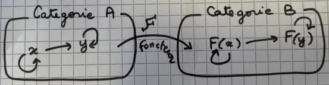

+++
title = 'Functional Programming : Functor and Category' 
date = 2019-11-24T00:50:52+01:00
+++

## Definition intuitive d'un foncteur et d'une catégorie

En design pattern fonctionnel : 

### Un foncteur (functor) 
- est une structure de données composée d'éléments et d'une opération de transformation 
qui s'applique à chacun des éléments de la structure de données et qui conserve cette structure

Pour un exemple de code de functor voir https://github.com/jeandi7/gofunctional/tree/main/functor

Le terme functor provient de la théorie mathématique des catégories.

Je dessine ici 2 catégories A et B , notre foncteur 
- qui  fait passer notre structure de donnée avec des objets x, y de la catégorie A  (y compris les fléches que l'on voit sur le dessin)  
- aux objets F(x),F(y) de la catégorie B (toujours avec leurs les flèches )

On note qu'une catégorie est composée d'élements 
- qui sont soit des objets 
- soit des flèches

Les fléches d'une catégorie sont aussi appelées morphismes dans la théorie des catégories.
Ces fléches doivent vérifier certaines propriétées comme
- la composition
- l'associativité
- la neutralité

Pourquoi parler de catégorie ? 

Je me souviens (il y a bien longtemps) de la démonstration par l'absurde que l'ensemble des ensembles n'existe pas.
Et bien , c'est l'une des raisons pour laquelle on parle de catégorie....et pas d'ensemble.

Si les fléches de notre catégorie  forment un ensemble, on parle alors de catégorie localement petite.

Si nos objets forment un ensemble, on parle alors de petite catégorie 

### Remarque sur le monoïde : 

- Un monoïde est une catégorie localement petite c'est à dire réduite à un unique objet et à un ensemble de fléches.

## Definition mathématique d'un foncteur et d'une catégorie

j'ai repris les définitions que je trouve claires du cours Paris 13 de Damiano Mazza

En programmation fonctionelle, on restera toujours sur des petites catégories.

et

_cours complet disponible sur https://www-lipn.univ-paris13.fr/~mazza/teaching/IntroCat.pdf_

_ainsi que pour le Qui est Quoi le lien :_
_http://s.dugowson.free.fr/recherche/connectologie/monoides.pdf_

_cours en anglais sur les categories : http://katmat.math.uni-bremen.de/acc/acc.pdf_