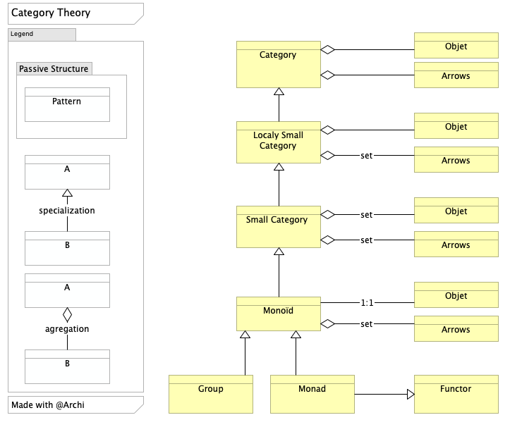

+++
title = 'Functional Programming : Monad'
date = 2019-11-25T23:16:47+01:00
+++

# La Monade

La monade, on la trouve partout  sur le net
et dans la littérature fonctionnelle

On trouve des explications mathématiques, formelles, par analogie, des dessins avec des boites et des animaux, etc...

Une monade c'est d'abord un style de programmation qui permet de traiter des données immutables à travers un pipe-line dans lequel on insère des traitements ...

On peut chainer plusieurs monades entre-elles pour effectuer un calcul 

Voir un exemple de code sur https://github.com/jeandi7/gofunctional/tree/main/monad

Le terme monad, comme functor  provient de la théorie mathématique des catégories.

### Remarque sur le monade : 

- On a vu précédemment qu'un monoïde est une catégorie localement petite réduite à un unique objet.
- Une monade est elle même un monoïde
- Une monade peut aussi être vue comme un foncteur particulier d'une catégorie vers elle-même

En attendant, ce petit schéma sous Archimate pour résumer la situation :

