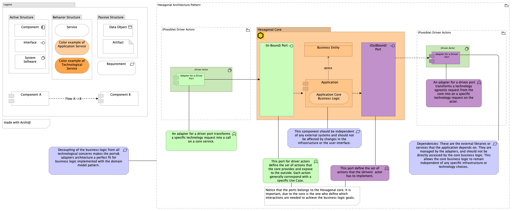

+++
title = 'Hexagonal Programmming : Part 1'
date = 2022-11-03T00:06:38+01:00
+++

## Programmation Hexagonale : (Part 1)

- Pour poser le vocabulaire du design hexagonal.

- Un schéma sous le standard Archimate.

- Driver Actor, Driven Actor, (InBound Port) , (OutBound) Port, Hexagonal Core

