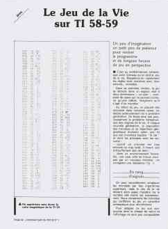

+++
title = 'Evolution'
date = 2023-11-01T01:40:44+01:00
+++

## Introduction :

The Code of the Game of Life (1970: John Conway Always and Again) was proposed in the magazine "L'ordinateur de poche" in April 1981

I always have the magazine at home on this complete Turing cellular automaton

158 bytes on Ti58 !!!

See : https://github.com/jeandi7/aiandgo

## Remarques:

- Les mécanismes actuels de l'évolution sont,et de loin,bien plus riches que n'importe lequel des algorithmes génétiques.

- Par exemple, pour notre automate cellulaire, les mutations peuvent invoquer des inversions (reversals), des duplications, ou tout autre mouvement de large morceau d'ADN.

- La biologie est dans la situation de la physique avant la mécanique quantique.Il nous manque une nouvelle théorie de l'évolution.

- Espérons qu'une nouvelle théorie de l'évolution apparaitra dans ce XXI siècle: Quelques pistes :

- Denton, D'Arcy Thompson: There are Platonic forms or archetypes in nature and mathematical laws influencing the forms of living beings.

- Conway-Morris, de Duve: the evolution of life would in one way or another be channeled towards increasingly complex forms leading to the existence of conscious beings.

- Schützenberger: L'évolution suit un algorithme de contrôle optimal.